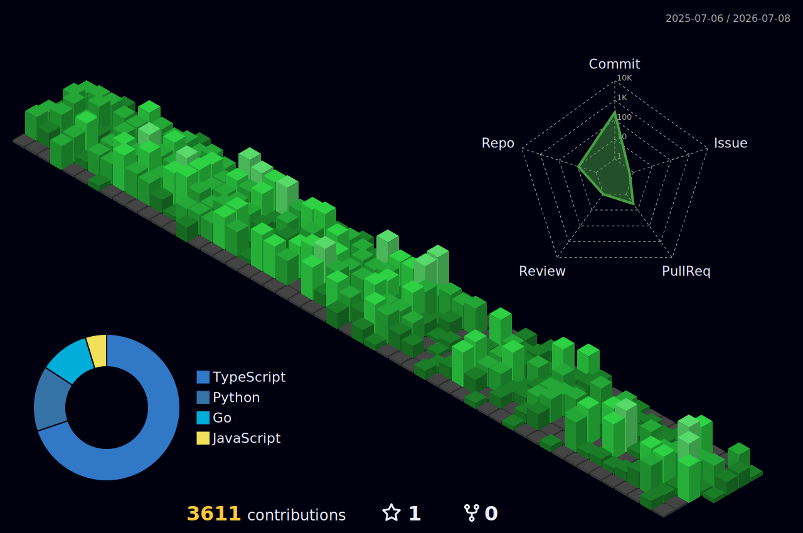

<!--
  README de perfil do GitHub — colar em: github.com/LucasHARosa/LucasHARosa (repositório especial de perfil)
  Paleta: verde ácido #77ee00 / #b0da9e sobre fundo escuro (identidade do lucasrosa.dev.br)
-->

<!-- ══════════════════ HEADER ══════════════════ -->

&nbsp;

<!-- ══════════════════ SPOTIFY + COMMITS 3D ══════════════════ -->

<!-- ══════════════════ SOBRE ══════════════════ -->

## Sobre

Desenvolvedor **Full-Stack & Mobile** com base sólida em **Ciência da Computação / Engenharia** e forte atuação em **IA e visão computacional**. Trabalho de ponta a ponta: modelo a arquitetura no back-end, entrego a interface no front-end e publico o app na loja.

- **Em produção agora**: fintech, plataformas de ingressos, logística nacional e apps nas lojas Google/Apple.
- **Da graduação à indústria**: TCC com YOLOv8 para inspeção de soldagem, redes neurais, robótica e microcontroladores.
- **Do front ao metal**: React/Next no topo, Node/Nest/FastAPI/Go no meio, C/C++ e IoT na base.
- **Sempre aprendendo**: em 2025 mergulhei em Go e FastAPI para serviços de baixa latência.

<!-- ══════════════════ DESTAQUES ══════════════════ -->

## Projetos em destaque

<table>
  <tr>
    <td width="50%" valign="top">
      <h3>DubPay</h3>
      
Fintech completa para transações financeiras digitais — pagamentos seguros para pessoas e empresas.

      
<code>Next.js</code> <code>React</code> <code>Vite</code>

      
    </td>
    <td width="50%" valign="top">
      <h3>RosaBet</h3>
      
Apostas esportivas + cassino com odds ao vivo via WebSocket (5s), liquidação automática e PIX simulado.

      
<code>FastAPI</code> <code>WebSocket</code> <code>PostgreSQL</code> <code>Redis</code>

      
      
    </td>
  </tr>
  <tr>
    <td width="50%" valign="top">
      <h3>Cortex</h3>
      
App de monitoramento IoT em tempo real: detecta anomalias, gera gráficos e alarmes. Publicado nas lojas.

      
<code>React Native</code> <code>Expo</code> <code>IoT</code>

      
      
    </td>
    <td width="50%" valign="top">
      <h3>Daily Diet</h3>
      
Acompanhamento de dieta com app mobile e API em Go, métricas de progresso e estimativa de calorias com IA (Gemini).

      
<code>Go</code> <code>React Native</code> <code>PostgreSQL</code>

      
      
    </td>
  </tr>
  <tr>
    <td width="50%" valign="top">
      <h3>Nacional Go</h3>
      
Plataforma líder nacional em transporte veicular: e-commerce, área do cliente e rastreamento em tempo real.

      
<code>React</code> <code>PHP</code>

      
    </td>
    <td width="50%" valign="top">
      <h3>TCC · IA para Soldagem</h3>
      
Visão computacional com YOLOv8 para detectar e classificar padrões de soldagem — controle de qualidade automatizado.

      
<code>Python</code> <code>YOLOv8</code> <code>CNN</code>

      
    </td>
  </tr>
</table>

Mais de 25 projetos no meu <a href="https://lucasrosa.dev.br/">portfólio</a>

<!-- ══════════════════ STACK ══════════════════ -->

## Stack

<table>
  <tr>
    <td><b>Front-end</b></td>
    <td></td>
  </tr>
  <tr>
    <td><b>Back-end</b></td>
    <td></td>
  </tr>
  <tr>
    <td><b>Mobile</b></td>
    <td></td>
  </tr>
  <tr>
    <td><b>IA &amp; Dados</b></td>
    <td></td>
  </tr>
  <tr>
    <td><b>Infra</b></td>
    <td></td>
  </tr>
</table>

<!-- ══════════════════ STATS ══════════════════ -->

## GitHub

|                                                                                                                                                                                                             |                                                                                                                                                                                                   |
| ----------------------------------------------------------------------------------------------------------------------------------------------------------------------------------------------------------- | ------------------------------------------------------------------------------------------------------------------------------------------------------------------------------------------------- |
|  |  |

<!-- ══════════════════ FOOTER ══════════════════ -->

