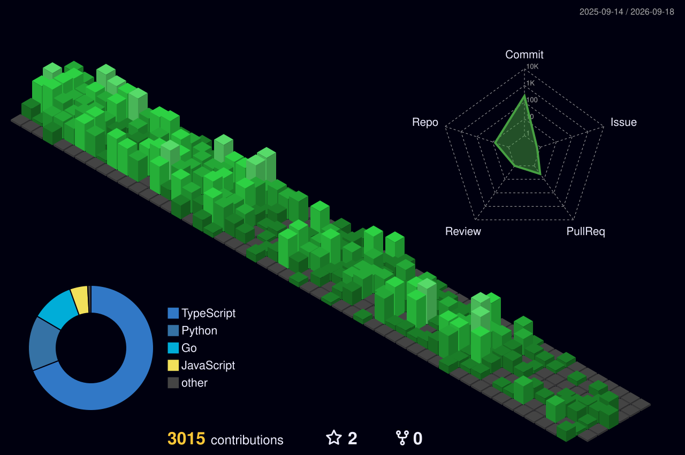

<!-- HEADER -->

## Sobre

Sou **Software Engineer / Desenvolvedor Full-Stack** e Engenheiro Mecatrônico formado pela **Universidade de Brasília (UnB)**.

Atuo no desenvolvimento de produtos de ponta a ponta, com experiência profissional em **back-end, aplicações web e mobile**, trabalhando desde arquitetura, APIs e regras de negócio até interfaces, integrações e publicação de aplicativos.

Minha experiência inclui diferentes contextos, como **fintech, plataformas web, logística, sistemas corporativos, IoT e aplicações mobile em produção**.

* **Back-end:** Java / Spring Boot · Node.js / NestJS · Python / FastAPI / Django · Go
* **Front-end:** React · Next.js · TypeScript
* **Mobile:** React Native · Expo
* **Dados:** PostgreSQL · DB2 · MongoDB · Redis
* **Infra & Integrações:** Docker · Kubernetes · RabbitMQ · CI/CD · WebSockets · SSE
* **Engenharia:** APIs REST · Microsserviços · SOLID · testes automatizados · Git

## Projetos em destaque

<table>
  <tr>
    <td width="50%" valign="top">
      <h3>DubPay</h3>
      
Fintech com soluções de checkout, conciliação e pagamentos. Atuação em aplicações e serviços relacionados ao ecossistema financeiro, integrações, mensageria e infraestrutura conteinerizada.

      
<code>Java</code> <code>React</code> <code>Next.js</code> <code>RabbitMQ</code> <code>Docker</code> <code>Kubernetes</code>

      
    </td>
    <td width="50%" valign="top">
      <h3>RosaBet</h3>
      
Plataforma full-stack com API em FastAPI, autenticação JWT, PostgreSQL, Redis, WebSockets para odds em tempo real e processamento automático de apostas.

      
<code>Python</code> <code>FastAPI</code> <code>PostgreSQL</code> <code>Redis</code> <code>WebSocket</code>

      
      
    </td>
  </tr>

  <tr>
    <td width="50%" valign="top">
      <h3>Daily Diet</h3>
      
Aplicação mobile acompanhada por uma API REST em Go, com arquitetura em camadas, autenticação JWT, PostgreSQL, métricas e integração com IA.

      
<code>Go</code> <code>PostgreSQL</code> <code>JWT</code> <code>Docker</code> <code>React Native</code>

      
      
    </td>

<td width="50%" valign="top">
  <h3>Cortex</h3>
  
Aplicativo mobile para monitoramento IoT em tempo real, exibindo dados de sensores, anomalias, gráficos e alarmes. Publicado na Google Play e App Store.

  
<code>React Native</code> <code>Expo</code> <code>IoT</code>

  
  
</td>

  </tr>

  <tr>
    <td width="50%" valign="top">
  <h3>Base3</h3>

  

    Plataforma de gestão educacional para escolas, cursos e alunos,
    com funcionalidades administrativas, acompanhamento acadêmico
    e integração entre front-end e serviços back-end.
  

  

    <code>React</code>
    <code>NestJS</code>
    <code>TypeScript</code>
    <code>APIs REST</code>
  

  
</td>

<td width="50%" valign="top">
  <h3>TCC · IA para Soldagem</h3>
  
Projeto de visão computacional aplicado à inspeção industrial, utilizando YOLOv8 para detecção e classificação de padrões de soldagem.

  
<code>Python</code> <code>YOLOv8</code> <code>CNN</code> <code>Visão Computacional</code>

  
</td>

  </tr>
</table>

  Veja outros projetos em <a href="https://lucasrosa.dev.br/">lucasrosa.dev.br</a>

## Stack

<table>
  <tr>
    <td><b>Back-end</b></td>
    <td></td>
  </tr>
  <tr>
    <td><b>Front-end</b></td>
    <td></td>
  </tr>
  <tr>
    <td><b>Mobile</b></td>
    <td></td>
  </tr>
  <tr>
    <td><b>Dados</b></td>
    <td></td>
  </tr>
  <tr>
    <td><b>Infra</b></td>
    <td></td>
  </tr>
</table>

## GitHub

|                                                                                                                                                                                                               |                                                                                                                                                                                                    |
| ------------------------------------------------------------------------------------------------------------------------------------------------------------------------------------------------------------- | -------------------------------------------------------------------------------------------------------------------------------------------------------------------------------------------------- |
|  |  |

## Agora no Spotify

