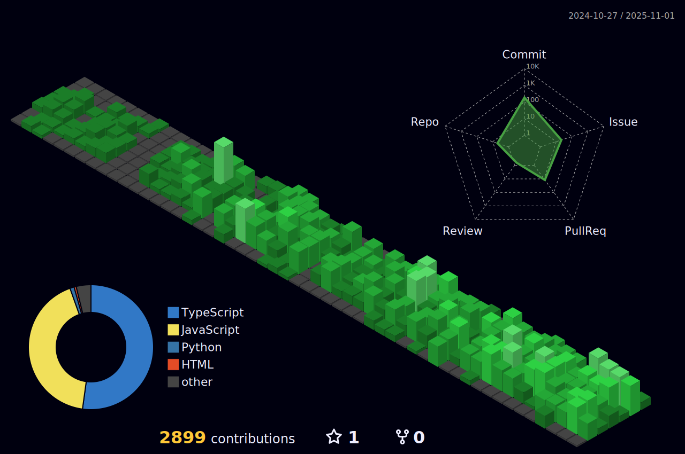

   

 |  |  |  
 | ----------- | ----------- |

- Atualmente trabalho com:
  - 📱 Desenvolvimento Front-End
  - 💾​ Desenvolvimento Back-End
  
- Tenho experiência em:
   - 🧠 Machine Learning  
   - 👀 Visão computacional
   - 🖥 Programação em diversas linguagens 
   - 📊 Análise de dados
   - 🤖 Robótica
   - 🎚 Programação de controladores e microcontroladores
   - ✏ Desenho Mecânico

 
<h2>Nesse perfil você encontra projetos com:</h2>

 

<h2> Meus contatos</h2>

 
 

